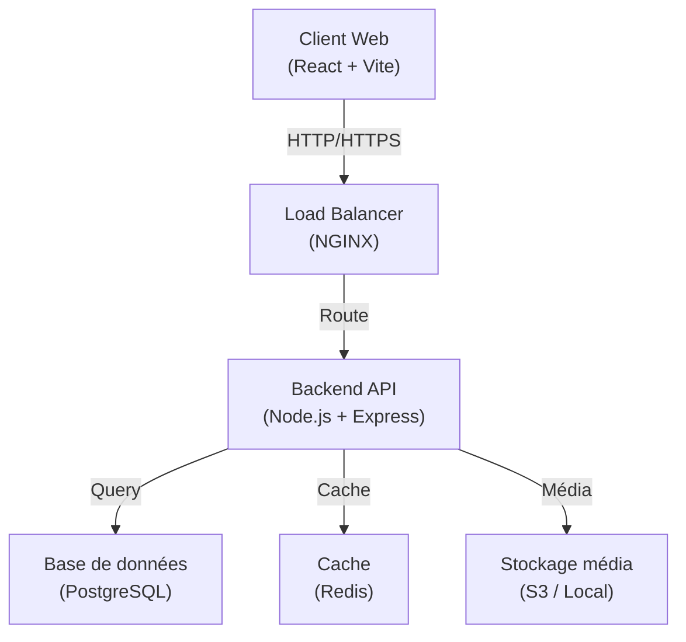
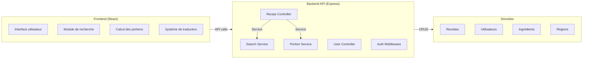
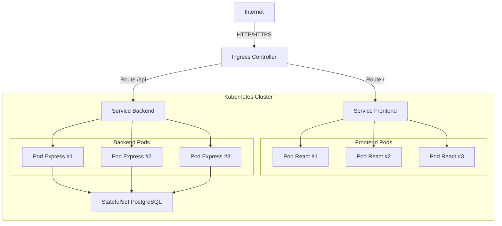
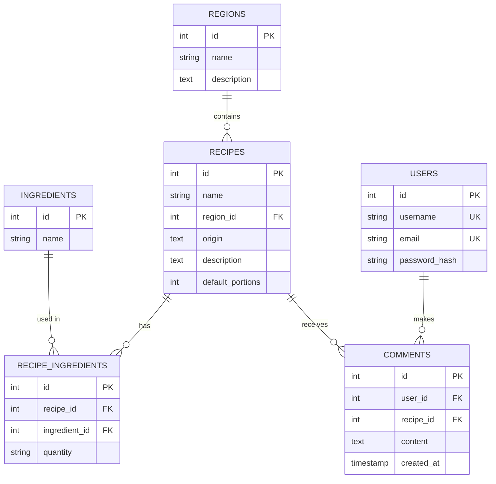
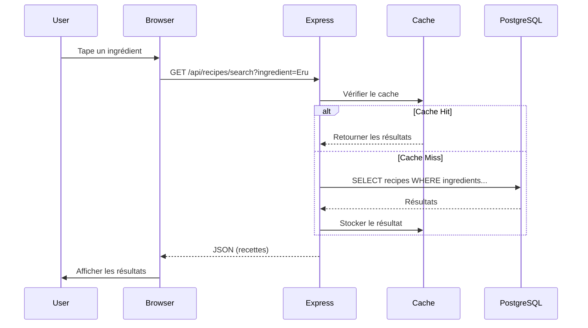
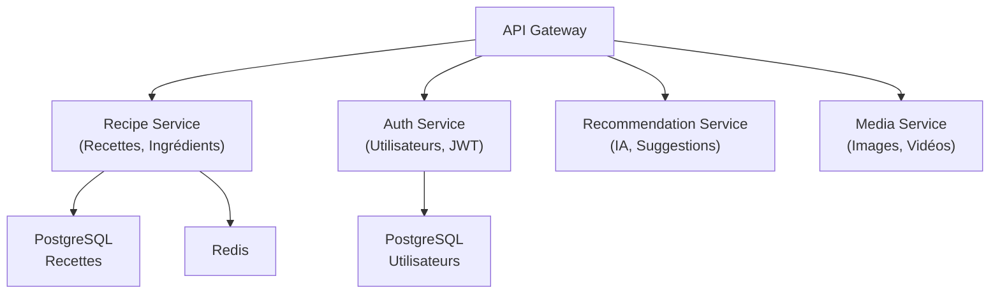

# Architecture Document - TasteCam Heritage

## 1. Vue d'ensemble

TasteCam Heritage est une plateforme web destinée à préserver et valoriser les recettes traditionnelles camerounaises. L'architecture suit un pattern monolithique évolutif vers microservices.

### Stack technique
- **Frontend** : React 18 + Vite
- **Backend** : Node.js 20 + Express.js
- **Base de données** : PostgreSQL 15
- **Conteneurisation** : Docker
- **Orchestration** : Kubernetes (étape 2)
- **CI/CD** : Jenkins (étape 2)
- **Monitoring** : Prometheus + Grafana (étape 3)

---

## 2. Architecture générale

### Diagramme d'architecture haute niveau



---

## 3. Diagramme des composants



---

## 4. Diagramme de déploiement



---

## 5. Modèle de données



---

## 6. Flux de requête

### Recherche de recette par ingrédient



---

## 7. Style architectural : Layered + MVC

L'application suit une architecture en couches avec le pattern MVC :

### **Couche Présentation**
- React components
- Vite build system
- i18n translations

### **Couche Application (Controllers)**
- Express routes
- Request/Response handlers
- Validation

### **Couche Métier (Services)**
- Logique de recherche
- Calcul des portions
- Gestion des utilisateurs

### **Couche Données (Models)**
- PostgreSQL database
- ORM (future: Sequelize/Prisma)
- Migrations

---

## 8. Qualités architecturales

### Scalabilité
- **Horizontal scaling** : Déploiement multi-pods Kubernetes
- **Caching** : Redis pour les requêtes fréquentes
- **CDN** : Servir les assets statiques

### Performance
- **Compression** : GZIP sur les réponses API
- **Lazy loading** : Images et vidéos chargées à la demande
- **Code splitting** : Vite optimise les bundles

### Sécurité
- **Authentication** : JWT tokens
- **Validation** : Input sanitization
- **CORS** : Contrôle des origines autorisées
- **HTTPS** : Chiffrage des données en transit

### Maintenabilité
- **Modularité** : Séparation des services
- **Documentation** : OpenAPI/Swagger
- **Tests** : Jest avec 80% couverture
- **Logging** : Winston pour les logs structurés

### Disponibilité
- **Health checks** : Liveness et readiness probes
- **Auto-restart** : Politique de redémarrage Kubernetes
- **Backup** : Snapshots PostgreSQL

---

## 9. Évolution future (Microservices)



---

## 10. Infrastructure as Code

### Docker Compose (Développement local)
```yaml
services:
  db:
    image: postgres:15
    volumes:
      - db_data:/var/lib/postgresql/data
  backend:
    build: ../backend
    depends_on: [db]
  frontend:
    build: ../frontend
```

### Kubernetes (Production)
- **Helm charts** pour déploiement standardisé
- **StatefulSet** pour PostgreSQL
- **Deployment** pour applications stateless
- **Ingress** pour le routage HTTP

---

## 11. Metriques de monitoring

### Prometheus
- `http_requests_total` : Total des requêtes
- `http_request_duration_seconds` : Latence
- `db_query_duration_seconds` : Performance DB
- `cache_hit_ratio` : Efficacité du cache

### Grafana
- Dashboard de l'application
- Dashboard de la base de données
- Dashboard d'infrastructure

---

## Conclusion

TasteCam Heritage combine une architecture monolithique simple pour le MVP avec la scalabilité en microservices. Cette approche permet un démarrage rapide tout en restant extensible pour les besoins futurs.

**État actuel** : Monolithe layered simple (React + Express + PostgreSQL)
**Phase 2** : Extraction de services (Auth, Recommendations)
**Phase 3** : Kubernetes + Jenkins + Monitoring complets
